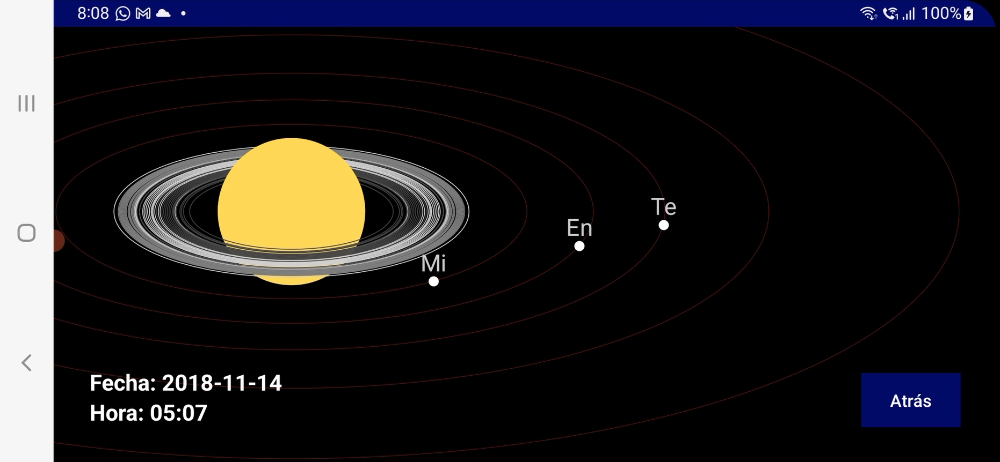
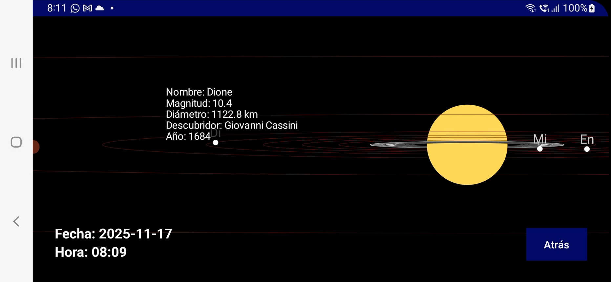

# SimSaturno – Simulador de Saturno en Android

## Descripción
SimSaturno es una aplicación Android desarrollada en **Java**, que simula la apariencia de **Saturno** vista a través de un telescopio.  
Permite visualizar el planeta, sus **anillos** y **principales satélites**, mostrando su posición en función de la **fecha y hora** seleccionadas.

Este proyecto fue desarrollado como **Trabajo de Fin de Grado** y demuestra conocimientos en programación Android, gráficos 2D y cálculos astronómicos básicos.

---

## Características
- Simulación del **planeta Saturno** con anillos y semi-hemisferio visible.  
- Visualización de los **satélites principales**: Mimas, Encélado, Tethys, Dione, Rhea, Titán y Japeto.  
- **Posición de los satélites** calculada según fecha y hora seleccionadas.  
- **Zoom y desplazamiento (pan)** mediante gestos táctiles.  
- Información detallada de cada satélite al seleccionarlo.  
- Interfaz simple y clara, compatible con dispositivos Android modernos.

---

## Tecnologías
- Lenguaje: **Java**  
- IDE: **Android Studio**  
- Base de datos **SQLite** para almacenar información de satélites  
- Gráficos 2D con **Canvas y Paint**  
- Manejo de gestos con **ScaleGestureDetector** y **MotionEvent**

---

## Instalación / Uso
1. Clonar el repositorio:

```bash
git clone https://github.com/frajalsan/SimSaturno.git
```

2. Abrir el proyecto en Android Studio.
3. Compilar y ejecutar en un emulador o dispositivo Android.
4. Seleccionar fecha y hora para ver la posición de los anillos y satélites.
5. Usar gestos de zoom y pan para explorar Saturno y sus satélites.

---

## Capturas de pantalla

<p align="center">
  
  
</p>

---

## Licencia

Este proyecto está bajo la MIT License – ver archivo LICENSE para más detalles.

---

## Autor

frajalsan
## Autor

**frajalsan**  
[GitHub](https://github.com/frajalsan)


